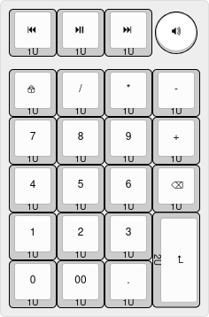

# LK23 Numpad / Macropad

## Layout

[Keyboard Layout Editor](https://www.keyboard-layout-editor.com/##@_css=.keyborder%5Bstyle*%2F=%22%23ff0000%22%5D%20%7B%0A%20%20%20%20border-radius%2F:%2050%25%20!important%2F%3B%0A%20%20%20%20background-color%2F:%20%23ccc%20!important%2F%3B%0A%7D%0A.keytop%5Bstyle*%2F=%22%23ff4223%22%5D%20%7B%0A%20%20%20%20border-radius%2F:%2050%25%20!important%2F%3B%0A%20%20%20%20background-color%2F:%20%23fff%20!important%2F%3B%0A%7D%3B&@_p=R1&a:7%3B&=%3Ci%20class%2F='kb%20kb-Multimedia-Rewind-Start'%3E%3C%2F%2Fi%3E%0A%0A%0A%0A1U&=%3Ci%20class%2F='kb%20kb-Multimedia-Play-Pause'%3E%3C%2F%2Fi%3E%0A%0A%0A%0A1U&=%3Ci%20class%2F='kb%20kb-Multimedia-FastForward-End'%3E%3C%2F%2Fi%3E%0A%0A%0A%0A1U&_c=%23ff0000&p=CHICKLET%3B&=%3Ci%20class%2F='kb%20kb-Multimedia-Volume-Up-2'%3E%3C%2F%2Fi%3E%3B&@_y:0.25&c=%23cccccc&p=R1%3B&=%3Ci%20class%2F='kb%20kb-Unicode-Lock-Closed-2'%3E%3C%2F%2Fi%3E%0A%0A%0A%0A1U&=%2F%2F%0A%0A%0A%0A1U&=*%0A%0A%0A%0A1U&=-%0A%0A%0A%0A1U%3B&@_p=R2%3B&=7%0A%0A%0A%0A1U&=8%0A%0A%0A%0A1U&=9%0A%0A%0A%0A1U&=+%0A%0A%0A%0A1U%3B&@_p=R3%3B&=4%0A%0A%0A%0A1U&=5%0A%0A%0A%0A1U&=6%0A%0A%0A%0A1U&=%3Ci%20class%2F='kb%20kb-Unicode-BackSpace-DeleteLeft-Big'%3E%3C%2F%2Fi%3E%0A%0A%0A%0A1U%3B&@_p=R4%3B&=1%0A%0A%0A%0A1U&=2%0A%0A%0A%0A1U&=3%0A%0A%0A%0A1U%3B&@_ry:5.25%3B&=0%0A%0A%0A%0A1U&=00%0A%0A%0A%0A1U&=.%0A%0A%0A%0A1U%3B&@_r:90&rx:3&y:-1&x:-1&w:2%3B&=%3Ci%20class%2F='kb%20kb-Return-2'%3E%3C%2F%2Fi%3E%0A%0A%0A%0A2U)

### Variations

This keyboard has been designed as a standalone numpad with an extra top row to be used as a macro pad or media pad, as such, it can be configured in different ways when building it.

Here is the list of supported variations:

- Optional encoder on the top left key
- Optional encoder on the top right key
- The top two center keys can be replaced by a 0.91" OLED screen

This allows for a number of configuration on the extra top row that can be used for a number of things. Each of these variations are supported in the Vial firmware under the `Layout` tab. See [Vial Layout Options](#vial-layout-options) for more details.

|    Example `#1`     |     Example `#2`      |       Example `#3`       |         Example `#4`         |
| :-----------------: | :-------------------: | :----------------------: | :--------------------------: |
| ![Example Macropad] | ![Example Media Keys] | ![Example OLED + Volume] | ![Example OLED + 2 Encoders] |

[Example Macropad]: assets/vial-macropad.png
[Example Media Keys]: assets/vial-mediapad.png
[Example OLED + Volume]: assets/vial-oled-volume.png
[Example OLED + 2 Encoders]: assets/vial-oled-knobs.png

This PCB can also be built as a wireless keyboard using a nice!nano microcontroller. See [Wireless Support](#wireless-support) for more details on how to achieve this.

<!-- TODO: Create a diagram of things that can be installed or not like the lotus 58 https://raw.githubusercontent.com/4EBOOT/Lotus58/Glow/Glow/Image/layout_variations.png  -->

## PCB

|          PCB (Front)          |         PCB (Back)          |
| :---------------------------: | :-------------------------: |
| [![PCB Front]][PCB Front PNG] | [![PCB Back]][PCB Back PNG] |

[PCB Front]: output/pcb/img/lk23m-pcb-top.svg
[PCB Front PNG]: output/pcb/img/lk23m-pcb-top.png
[PCB Back]: output/pcb/img/lk23m-pcb-bottom.svg
[PCB Back PNG]: output/pcb/img/lk23m-pcb-bottom.png

The PCB has been designed in [KiCad EDA 8.0](https://www.kicad.org/) using the [`kicad-lkbd`](https://github.com/lambdakb/kicad-lkbd) libraries and [`kbplacer`](https://github.com/adamws/kicad-kbplacer).

You can preview the project files using [KiCanvas](https://kicanvas.org/?github=https%3A%2F%2Fgithub.com%2Flambdakb%2Fkeyboard-lk23m%2Fblob%2Fmain%2Fpcb%2Flk23m-pcb.kicad_pro) directly in your browser and download the latest fabrication files for JLCPCB from the [latest release](https://github.com/lambdakb/keyboard-lk23m/releases/latest/).

The exported schematic is also available under [`output/schematics`](output/schematics/).

### PCB Order

| Parameters                       | Value                  |
| -------------------------------- | ---------------------- |
| Base Material                    | FR4                    |
| Layers                           | 2                      |
| Dimensions                       | 76.2 × 119.06 mm       |
| PCB Thickness                    | 1.6 mm                 |
| PCB Color [^pcb-color]           | Black                  |
| Silkscreen                       | White                  |
| Surface Finish [^surface-finish] | Lead Free HASL or ENIG |
| Copper Weight                    | 1 oz                   |
| Via Covering                     | Tented                 |
| Min Via Hole Size                | 0.3 mm                 |
| Board Outline Tolerance          | ± 0.2 mm               |

[^pcb-color]: You can select any PCB color you want but some manufacturers such as JLCPCB may charge you more for uncommon combos (such as Blue PCB + ENIG Surface Finish).
[^surface-finish]: The "HASL (with lead)" option is extremely discouraged due to the risk of lead poisoning. We strongly recommend paying the premium for the "Lead Free HASL" option.

### JLCPCB Specific Options

<!-- NOTE: This is generic and used for ALL LambdaKB PCBs EXCEPT for cases PCB   -->

#### Mark on PCB

The following JCLPCB specific options are used to serialize PCBs on order. An 8 × 8 mm silkscreen square was added to the PCB to allow for a 2D barcode to be added.

| Parameters            | Value                       |
| --------------------- | --------------------------- |
| Mark on PCB           | 2D barcode (Serial Number)  |
| - Printing            | 2D barcode & Number         |
| - Code Type           | Data Matrix Code            |
| - Prefix              | `LKBD_LK23M_v100`           |
| - Unique Number       | Remove                      |
| - Incrementing Number | _`YYMM01`_ (e.g.: `250300`) |
| - 2D Barcode Size     | 8 × 8 mm                    |
| - 2D Barcode Position | Specify Position            |

Serial numbers are based on the current date using the `YYMM01` format for its incrementing numbers. Orders in February 2025 would start then start it at `250300`, making the final serial `LKBD_LK23M_v100_250300`.

## Cases

### FR4

|          Plate (Top)          |           Plate (Bottom)            |      Bottom Case (Top)      |         Bottom Case (Top)         |
| :---------------------------: | :---------------------------------: | :-------------------------: | :-------------------------------: |
| [![Plate Top]][Plate Top PNG] | [![Plate Bottom]][Plate Bottom PNG] | [![Case Top]][Case Top PNG] | [![Case Bottom]][Case Bottom PNG] |

[Plate Top]: output/case/fr4/img/lk23m-plate-top.svg
[Plate Top PNG]: output/case/fr4/img/lk23m-plate-top.png
[Plate Bottom]: output/case/fr4/img/lk23m-plate-bottom.svg
[Plate Bottom PNG]: output/case/fr4/img/lk23m-plate-bottom.png
[Case Top]: output/case/fr4/img/lk23m-bottom-top.svg
[Case Top PNG]: output/case/fr4/img/lk23m-bottom-top.png
[Case Bottom]: output/case/fr4/img/lk23m-bottom-bottom.svg
[Case Bottom PNG]: output/case/fr4/img/lk23m-bottom-bottom.png

The FR4 case has also been designed in [KiCad EDA 8.0](https://www.kicad.org/) and consist of two PCBs, one for the switch plate and one for the bottom plate.

Use the same parameters present in [PCB Order](./README.md#pcb-order) to order the plate and bottom PCB. For JLCPCB orders, you can select "Remove Mark" for the "Mark on PCB" option as there is no need to serialize the case itself. You can find the fabrication files in [`output/case/fr4/fabrication/jlcpcb`](output/case/fr4/fabrication/jlcpcb/).

If you prefer to fabricate them by any other mean (such as laser cut acrylic), you can download their board outlines as `DXF` in [`output/case/dxf`](output/case/dxf).

## BOM

| Part                   | Ref.                                                                                 | Quantity | Optional | Remarks                                                                                                                                                              |
| ---------------------- | ------------------------------------------------------------------------------------ | :------: | :------: | -------------------------------------------------------------------------------------------------------------------------------------------------------------------- |
| PCB                    | [LK23M PCB](./README.md#pcb)                                                         |    1     |    ❌    | See [PCB](./README.md#pcb) section on how to order it.                                                                                                               |
| Top Plate              | [FR4 Top Plate](./README.md#fr4)                                                     |    1     |    ✅    | Optional if using an alternative case.                                                                                                                               |
| Bottom Plate           | [FR4 Bottom Plate](./README.md#fr4)                                                  |    1     |    ✅    | Optional if using an alternative case.                                                                                                                               |
| Case Screws            | [M2 × 4 mm Low Profile Socket Head Screw (Hex)]                                      |    8     |    ✅    | Optional if using an alternative case. Low profile hex head screws are recommended, but any head type should be compatible. Screws up to 8 mm in length should work. |
| Case Standoffs         | [M2 × 12 mm Brass Hex Standoff]                                                      |    4     |    ✅    | Optional if using an alternative case. Longer / shorter standoff could work depending on how the controller is mounted and if using a battery.                       |
| Pro Micro Controller   | [Arduino Pro Micro 5V], [Adafruit KB2040] or [nice!nano]                             |    1     |    ❌    | Supports various Pro Micro style controller (including RP2040 based ones) as well as the nice!nano for wireless builds. [^wireless]                                  |
| MCU Socket             | [DIP-24 Round Socket (Wide, 15.24 mm)]                                               |    1     |    ✅    | Recommended to socket the controller, can be omitted if soldered directly. Compatibles pins are required such as dismantled [LED strip male adapters].               |
| Reset Push Button      | [DIP 2pin Momentary Push Button (6 × 3.5 mm)] (THT)                                  |    1     |    ✅    | Used as a reset switch, can be omitted if you flash the controller before installing it or if the controller can be put in bootloader mode from any other means.     |
| 1N418 Diodes           | [1N4148W T4 SOD-323] (SMD) or [1N4148 DO-35] (THT)                                   |  21-23   |    ❌    | Only 21 diodes are needed if the OLED screen is installed.                                                                                                           |
| Kailh Hot-Swap Sockets | [CPG151101S11-16] (SMD)                                                              |    19    |    ✅    | The top 4 keys can not be made hot-swappable due to size constraint and need to be soldered directly. All switches can be soldered directly to the PCB if preferred. |
| Key Switches           | Any [Cherry MX] Compatible Switch                                                    |  19-23   |    ❌    | Amount depends on the variant built, a two encoder OLED setup would require 2 EC12 encoder and 19 MX switches, while the key switches only variant needs 23.         |
| 2U Stabilizer          | Any standard [2U PCB mounted MX stabilizer]                                          |    1     |    ✅    | Recommended for Enter key stability.                                                                                                                                 |
| Rotary Encoder(s)      | Any [EC11] / [EC12] style 5-pin Encoder                                              |   0-2    |    ✅    | Optional, can be installed in place of the top left and/or top right most switches.                                                                                  |
| 100nF Capacitor(s)     | [1206 SMD Ceramic Capacitor] (SMD) or [104 Ceramic Disk Capacitor (5 × 2.5mm)] (THT) |   0-4    |    ✅    | Two recommended per encoder for noise filtering.                                                                                                                     |
| 0.91" OLED Display     | [SSD1306 0.91" 128X32 OLED I²C Display Module]                                       |   0-1    |    ✅    | Optional, replace the top middle two switches.                                                                                                                       |
| Power Slide Switch     | [PCM12SMTR] (SMD) or [MSK-12C02] (SMD)                                               |    1     |    ✅    | Only required for battery powered wireless builds. [^wireless]                                                                                                       |
| Battery Connector      | [JST-PH 2pin right-angle Male Connector]                                             |    1     |    ✅    | Only needed for battery powered wireless builds if the battery is not soldered directly to the board (recommended). [^wireless]                                      |
| 3.7V Li-Po Battery     | [603449 (1100 mAh)] or [503450 (1000 mAh)] 3.7V Li-Po Battery                        |    1     |    ✅    | Only required for battery powered wireless builds, any 3.7 V (1 Cell) Li-Po battery slimmer than 8 mm with a JST-PH connector should work. [^wireless]               |

<!-- NOTE: should we create a separate BOM for the case if we provide two different case ? -->

[M2 × 4 mm Low Profile Socket Head Screw (Hex)]: https://www.aliexpress.com/item/4001072025844.html
[M2 × 12 mm Brass Hex Standoff]: https://www.aliexpress.com/item/1005006049595637.html
[Arduino Pro Micro 5V]: https://www.sparkfun.com/pro-micro-5v-16mhz.html
[Adafruit KB2040]: https://www.adafruit.com/product/5302
[nice!nano]: https://nicekeyboards.com/nice-nano/
[DIP-24 Round Socket (Wide, 15.24 mm)]: https://www.aliexpress.com/item/1005005770166098.html
[LED strip male adapters]: (https://www.aliexpress.com/item/1005005742644313.html)
[1N4148W T4 SOD-323]: https://www.aliexpress.com/item/1005006127619725.html
[1N4148 DO-35]: https://www.aliexpress.com/item/4000142272546.html
[CPG151101S11-16]: https://www.aliexpress.com/item/1005007052649640.html
[Cherry MX]: https://www.aliexpress.com/item/1005006255961111.html
[2U PCB mounted MX stabilizer]: https://www.aliexpress.com/item/1005004229140548.html
[EC11]: https://www.aliexpress.com/item/32382989585.html
[EC12]: https://www.aliexpress.com/item/1005005196870256.html
[1206 SMD ceramic capacitor]: https://www.aliexpress.com/item/32966490820.html
[104 Ceramic Disk Capacitor (5 × 2.5mm)]: https://www.aliexpress.com/item/32971478818.html
[DIP 2pin Momentary Push Button (6 × 3.5 mm)]: https://www.aliexpress.com/item/1005001849576755.html
[SSD1306 0.91" 128X32 OLED I²C Display Module]: https://www.aliexpress.com/item/32777216785.html
[PCM12SMTR]: https://www.digikey.com/en/products/detail/c-k/PCM12SMTR/1640112
[MSK-12C02]: https://www.aliexpress.com/item/4000685483225.html
[JST-PH 2pin right-angle Male Connector]: https://www.aliexpress.com/item/1005004955655144.html
[603449 (1100 mAh)]: https://amzn.eu/d/e3uVbqB
[503450 (1000 mAh)]: https://aliexpress.com/item/1005003198563309.html

[^wireless]: See [Wireless Support](./README.md#wireless-support) for more details.

## Firmware

The pre-build firmware available in this repository are compiled using [Vial](https://get.vial.today/) (a fork of [QMK](https://qmk.fm) allowing customization via a GUI).

As per the original license of both Vial and QMK, the firmware itself is licensed under the GPLv3 license and its source code is available at [`vial-qmk/keyboards/lambdakb/lk23m`](https://github.com/lambdakb/vial-qmk/tree/lambdakb/keyboards/lambdakb/lk23m).

### Default Vial Keymap

| Layer 1           | Layer 2                        | Layer 3                         | Layer 4                         |
| ----------------- | ------------------------------ | ------------------------------- | ------------------------------- |
| ![Layout Default] | ![Layout Disable Left Encoder] | ![Layout Disable Right Encoder] | ![Layout OLED Screen in Center] |

### Vial Layout Options

| Default           | Disable Left Encoder           | Disable Right Encoder           | OLED Screen in Center           |
| ----------------- | ------------------------------ | ------------------------------- | ------------------------------- |
| ![Layout Default] | ![Layout Disable Left Encoder] | ![Layout Disable Right Encoder] | ![Layout OLED Screen in Center] |

[Layout Default]: assets/vial-layout-default.png
[Layout Disable Left Encoder]: assets/vial-layout-left-encoder.png
[Layout Disable Right Encoder]: assets/vial-layout-right-encoder.png
[Layout OLED Screen in Center]: assets/vial-layout-oled-screen.png

Each of these options can be combined to match the physical layout of your build.

## Wireless Support

To add wireless support to this keyboard, you will need a controller that provides power input and a charging circuit between the top RAW and GND such as the `nice!nano`.

The PCB itself provides a way to attach a JST-PH connector as well as a slide switch for power management. This slide switch must be set to ON for the charging circuit to work.

This hasn't been extensively tested yet and should be considered experimental (no wireless firmware will be provided for now). The feature was added to the PCB as way for us to prototype a potential wireless keyboard.

## License

This design is licensed under the [Creative Commons Attribution-NonCommercial-ShareAlike 4.0 International License (CC BY-NC-SA 4.0)](https://creativecommons.org/licenses/by-nc-sa/4.0/).

You are free to use, share, and adapt the design for non-commercial purposes, provided that:

- **Attribution**: Proper credit must be given, a link to the license provided, and any changes indicated.
- **NonCommercial**: The material cannot be used for commercial purposes without prior approval.
- **ShareAlike**: Any derivative works must be distributed under the same license.

If you are a retailer or business interested in selling this design or products derived from it, I am open to granting commercial licenses on a case-by-case basis. Please feel free to contact me to discuss terms.
